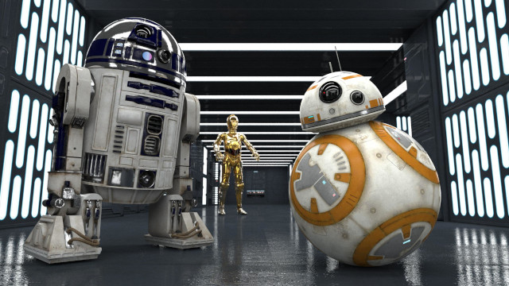
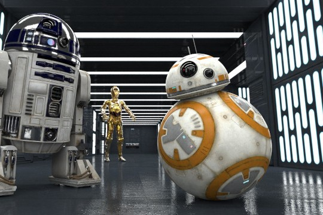
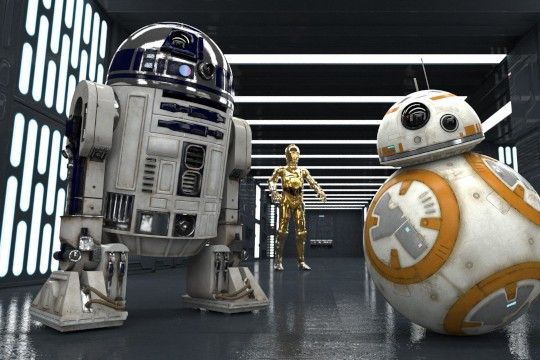
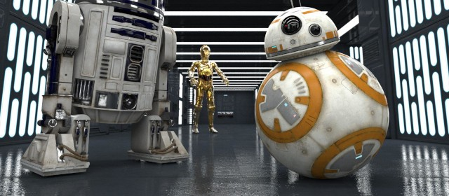
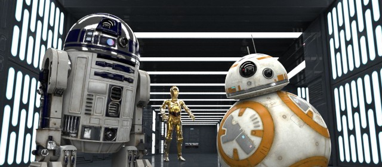

Drop
====

Returns a new image with pixels removed from one edge, shrinking the canvas by that amount.
`dropLeft(n)` removes the first `n` columns from the left, so the width becomes `n` pixels smaller.
`dropRight`, `dropTop` and `dropBottom` do the same for the right, top and bottom edges respectively.


### Examples

Using this image as our input:




```kotlin
 // remove the leftmost 100 pixels
image.dropLeft(100)
```




```kotlin
 // remove the rightmost 100 pixels
image.dropRight(100)
```




```kotlin
 // remove the top 80 pixels
image.dropTop(80)
```




```kotlin
 // remove the bottom 80 pixels
image.dropBottom(80)
```


