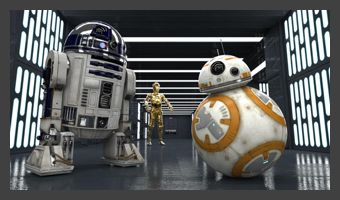
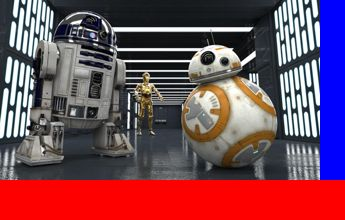

Pad
===

Resizes the canvas by adding a number of pixels around the edges in a given color.
This is the opposite of the [trim](trim.md) operation.

Pad can add pixels uniformly around all edges using `pad(k)` or on a specified edge only, using `padLeft(k)` and so on.


### Examples

Using this image as our input:


```kotlin
image.scale(0.5)
     .pad(10, Color.DARK_GRAY)
```



```kotlin
image.scale(0.5)
     .padRight(25, Color.BLUE)
     .padBottom(40, Color.RED)
```


